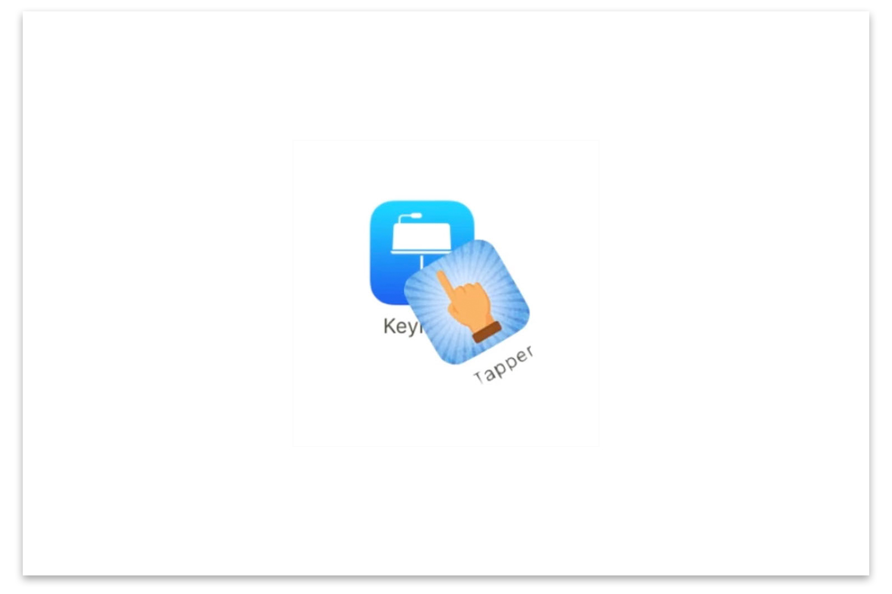

<iframe src="https://player.vimeo.com/video/216101350?loop=1&color=ffffff&title=0&byline=0&portrait=0" width="970" height="auto" frameborder="0" webkitallowfullscreen mozallowfullscreen allowfullscreen></iframe>

## Available in App store

This video is capturing a factual archive in motion by using the existing materials that are available for everyone: apps (in the Apple App Store in particular). The visual illustrations and letters of a set of app icons is utilized to convince the audience to download more apps through a narrative voiced over by Siri. This is a commentary on the excessive amount of repetitive apps available to us.

This narrative is created in Keynote, which is also an app.

