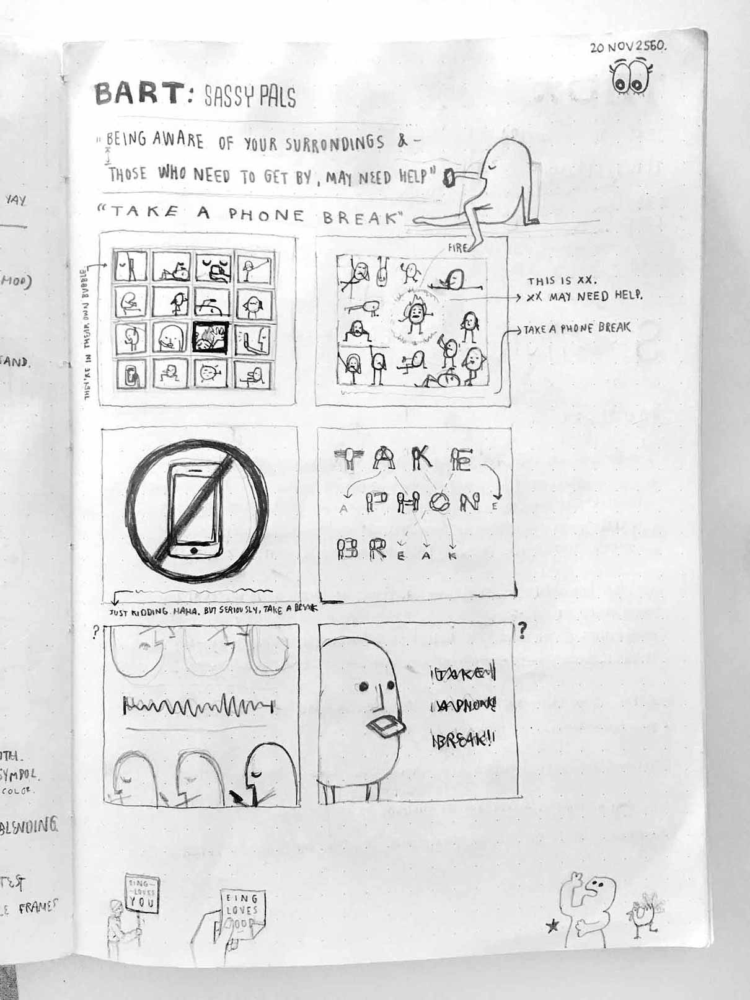
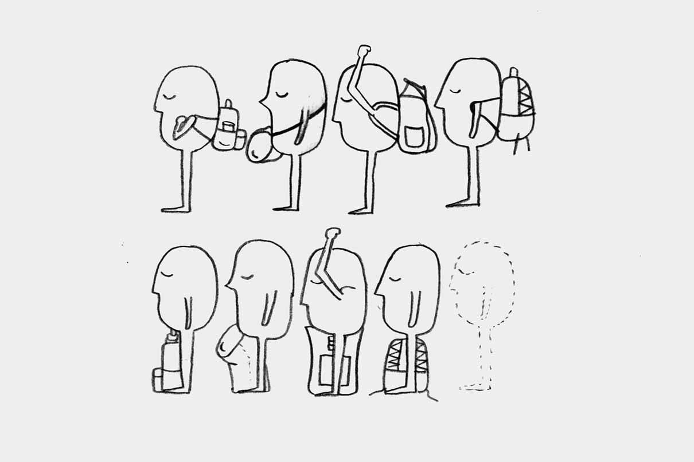
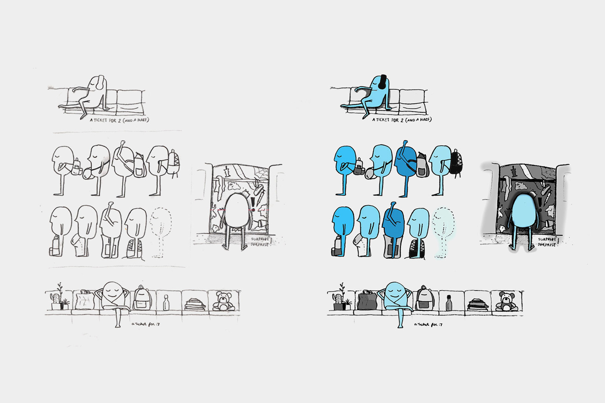
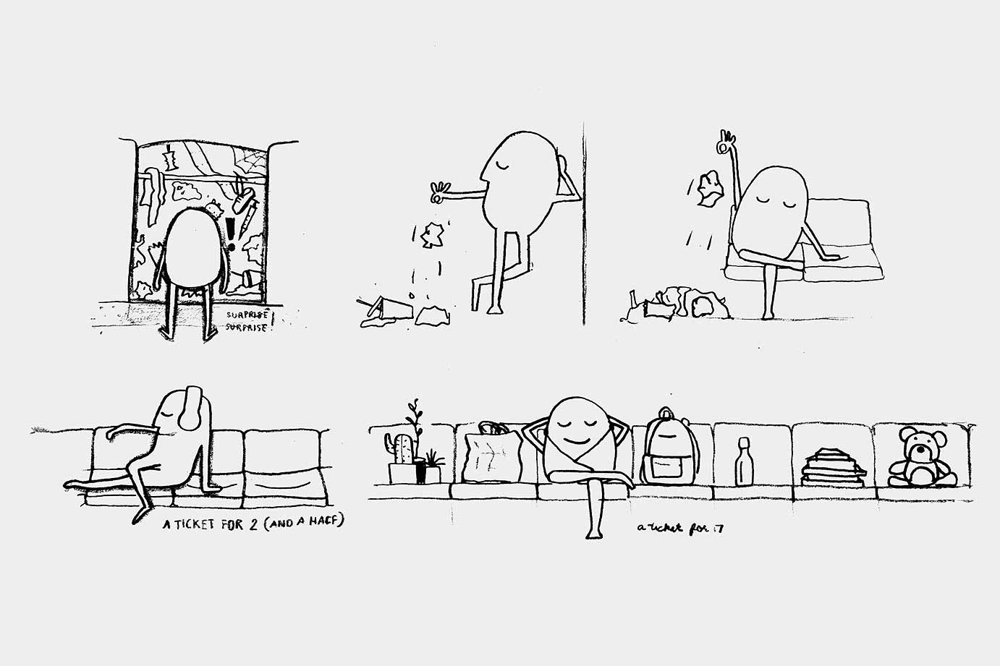
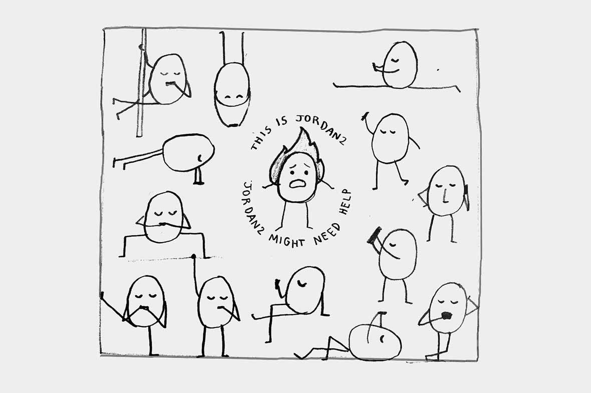
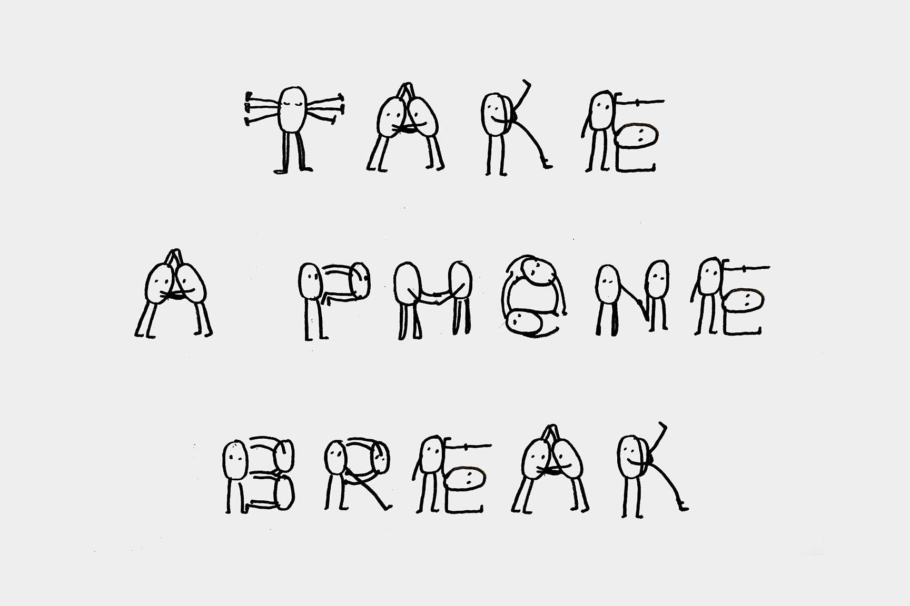

## Jordan is lucky

This project is part of an etiquette poster campaign created by [TBD\*](http://tbdcca.com) at CCA for Bay Area Rapid Transit, as known as “BART.” With a list of customers complaints, BART asked us to create a fun, cheeky, buzz-creating campaign that encourages behavior change or cooperation.
This poster encourages BART riders to put down their backpack when the train gets crowded to make room for other riders to get on.

[Check out the article about this campaign from BART](https://www.bart.gov/news/articles/2018/news20180207-0)

## Sketches

