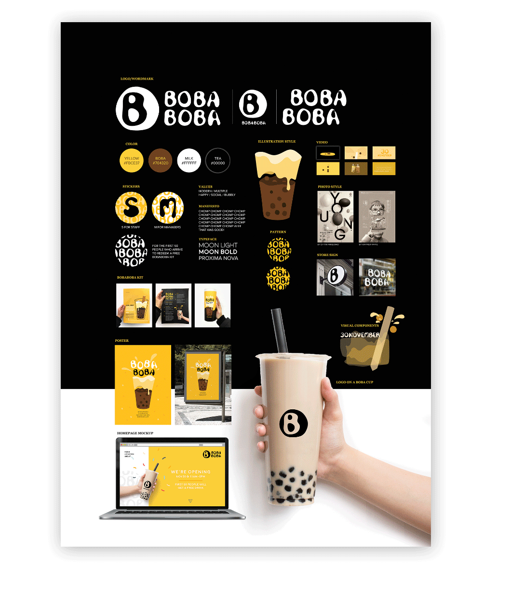
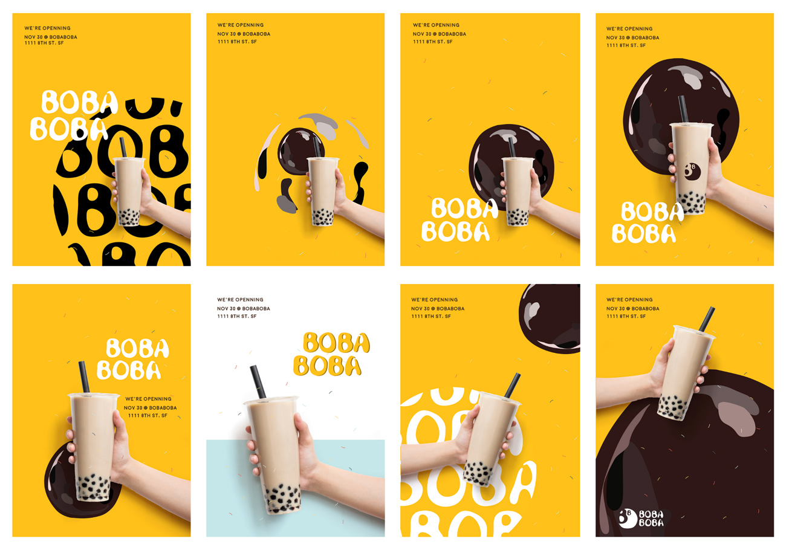
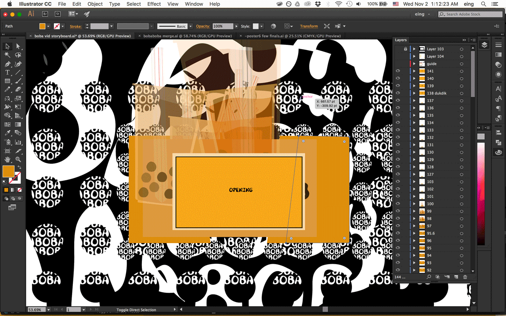

# Bobaboba (revisted)

## It’s so nice, we gotta say it twice.

This is a revisited project. The original version is shown at the bottom. 

Bobaboba is a concept for a boba tea shop. Not everyone knows what boba tea (tea with tapioca pearls) is, and so the challenge is to convince new customers who don't know what boba is to give it a try. Bobaboba's branding is focused on a friendly and inviting visual identity to appeal to wide range of audiences, especially targeting the younger ones. Colors and graphic elements play together to represent the rich, milky, creamy, refreshing and indulgent feel of boba milk tea.

## Colors used in the system

## Posters for the store opening

## Other design assets including buttons and stickers on the cups 

# Bobaboba: original version

Sometimes you just need a pair of fresh eyes to look and realize that what was told to you a year ago is quite true.

Up until this project, I had always been drawn to the color yellow, only to later realize that there are so many other beautiful palettes out there.

I revisted this project because I felt like the core idea was there, but I couldn't express it well in the design. The time I was given was spent on researching and exploring new concepts rather than focusing on one and building upon the one that is working.

### Poster for the whole visual system

Promotional video for the store opening. Each frame of the animation is an Illustrator layer

<iframe src="https://player.vimeo.com/video/216101169?loop=1&color=ffffff&title=0&byline=0&portrait=0" width="970" height="auto" frameborder="0" webkitallowfullscreen mozallowfullscreen allowfullscreen></iframe>

### Sketches

### Logo type making and exploration

### Image making

### Variations

### Each frame of the video is an Illustrator layer
