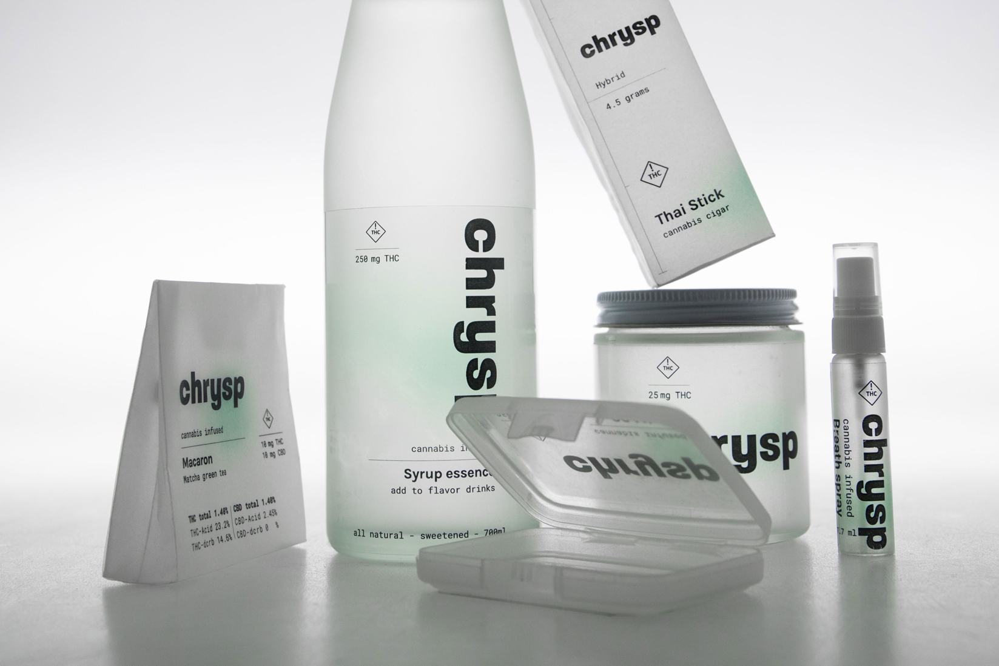
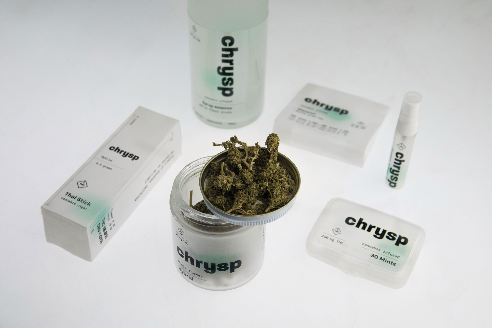
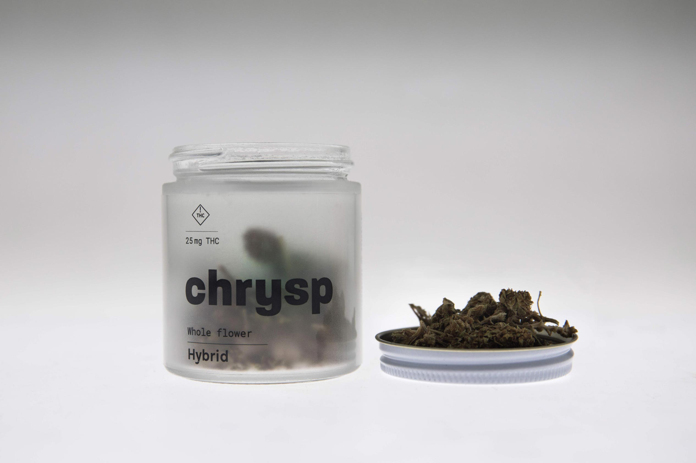

## Green. Gem. Stoned.

Chrysp is a line of cannabis products that encourages you to value your intake by cutting out all the unnecessary decorative graphic elements and include all of the products themselves as a part of the design.

Translucent materials are used for packaging to emphasize the transparency of information to create a straightforward yet inviting feel.

Instead of using the iconic marijuana leaf to immediately give away the main ingredient, a subtle green spot is used to visually reference the cannabis.

The name Chrysp (pronounced as 'crisp') originates from Chrysoprase, a green gemstone. Cannabis is green (mostly). It's a gem. It gets you stoned.

