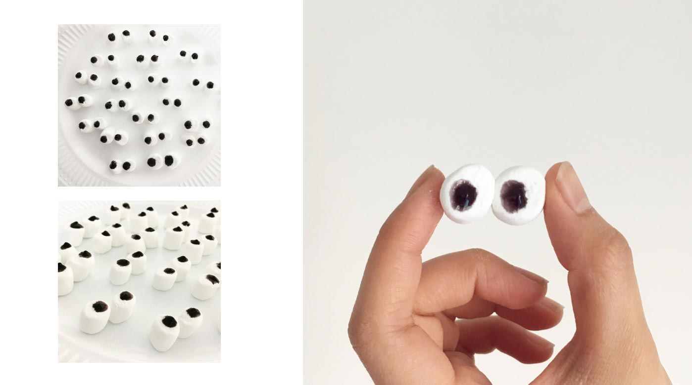
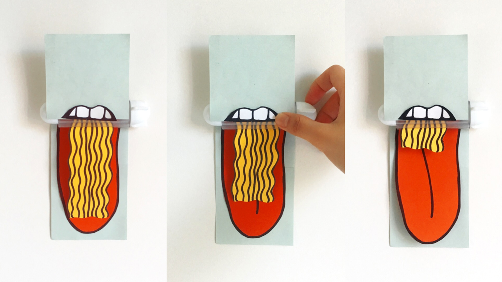
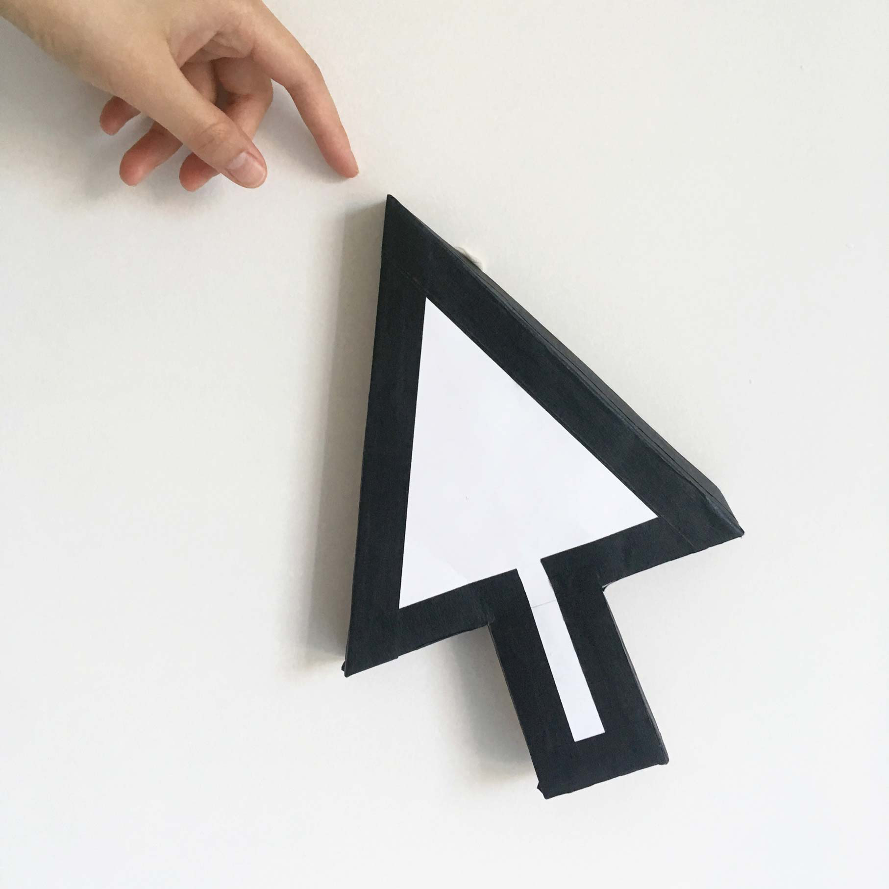

## A creative dumpster selling stuff that are most likely to leave a smiley face in your heart

Neverlame is a shop that sell things that are somewhat useless, but are what Neverlame believes should exist. The shop explores the boundaries between creativity, trash and treasure, and the interplay between physical and digital forms.

Neverlame was initially created as my thesis project as an investigation on the creative boundaries I felt were imposed on me as a “graphic design” student. I felt restricted by what was expected of me, and wanted to take the opportunity to experiment with merging my personal interest and design profession.

Most importantly, I wish to create something that I feel is missing in the graphic design world: playfulness.

**Phase 1** : Ideas, notes and sketches

**Phase 2** : Product explorations and prototypes

**Phase 3** : Branding

To be continued....
