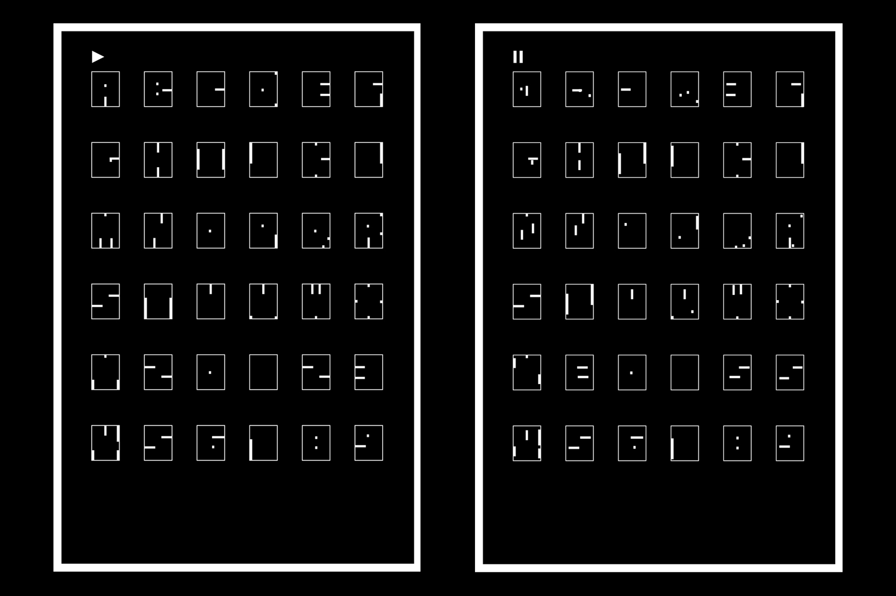

<iframe src="https://player.vimeo.com/video/264795871?loop=1&color=ffffff&title=0&byline=0&portrait=0" width="970" height="auto" frameborder="0" webkitallowfullscreen mozallowfullscreen allowfullscreen></iframe>

Pong is a typeface designed specifically to be coded using CSS. It is heavily influenced by the classic computer game Pong. 

This single-serving specimen site is divided into 3 sections: an animatable type specimen, a draggable build-your-own-letter space, and a long-scroll blown-up type specimen. Click anywhere to generate more Pong balls. Click and hold to crash your computer.  

