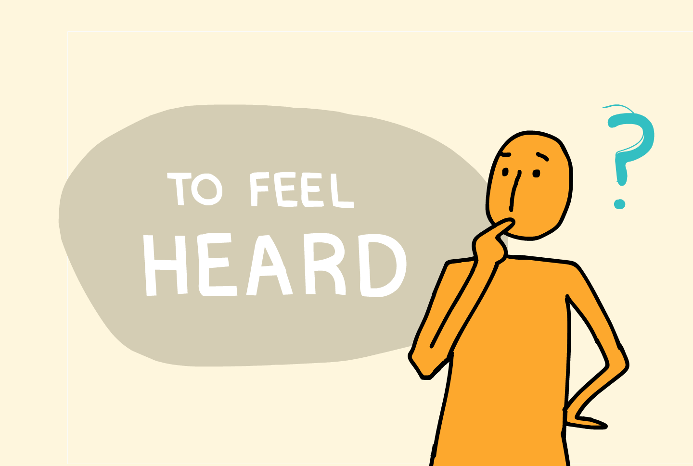

## Video for a Bay Area based non-profit

As a part of [TBD*](http://tbdcca.com) at CCA, I worked with the [StoryCenter](http://storycenter.org) team to create a simple and straightforward animation video that accurately conveys the depth and breadth of StoryCenter's mission by focusing on their digital storytelling workshop methodology, and what is offered to help broadcast StoryCenter message to a wider audience. StoryCenter is a non-profit organization that values digital storytelling as a way to empower others.

<iframe src="https://player.vimeo.com/video/247275750?loop=1&color=ffffff&title=0&byline=0&portrait=0" width="970" height="auto" frameborder="0" webkitallowfullscreen mozallowfullscreen allowfullscreen></iframe>

First storyboard sketch and character explorations

Illustration style explorations

Sketches of the first and second round of storyboards

Screenshots of animation process

Still images

